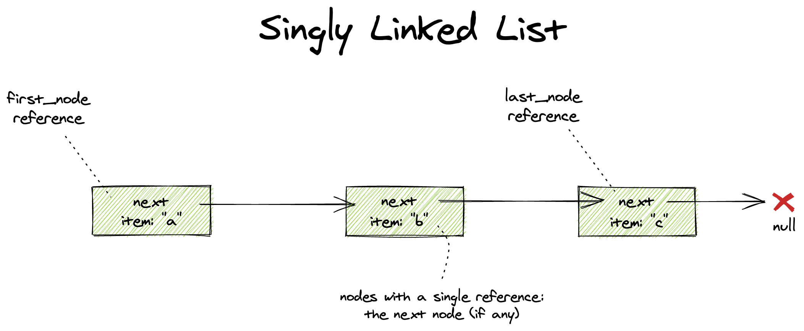
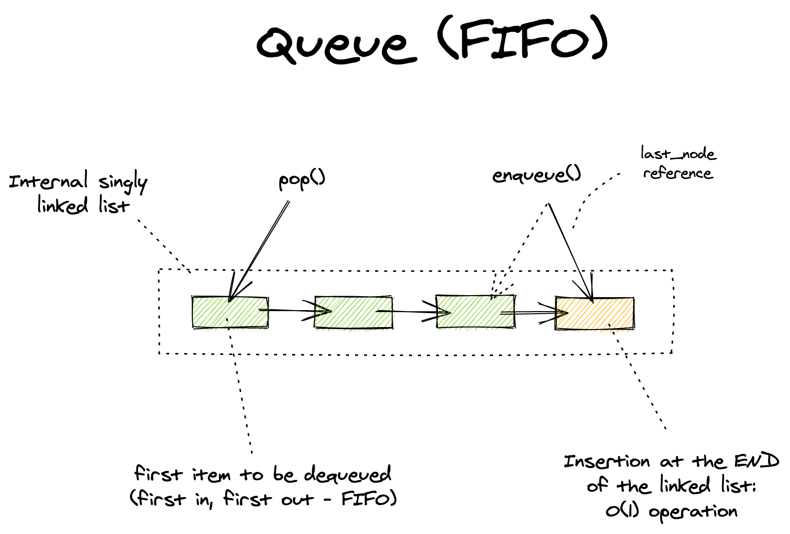
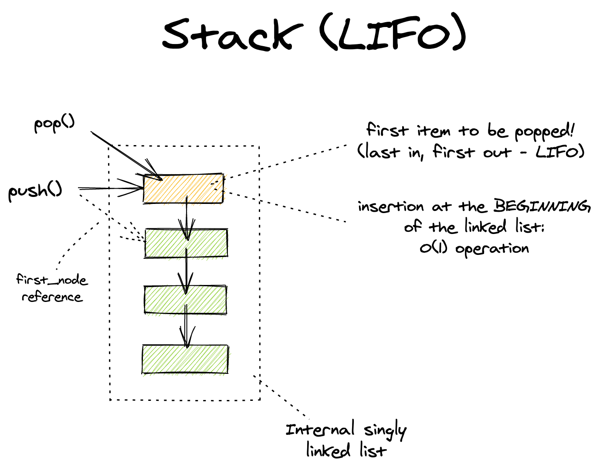
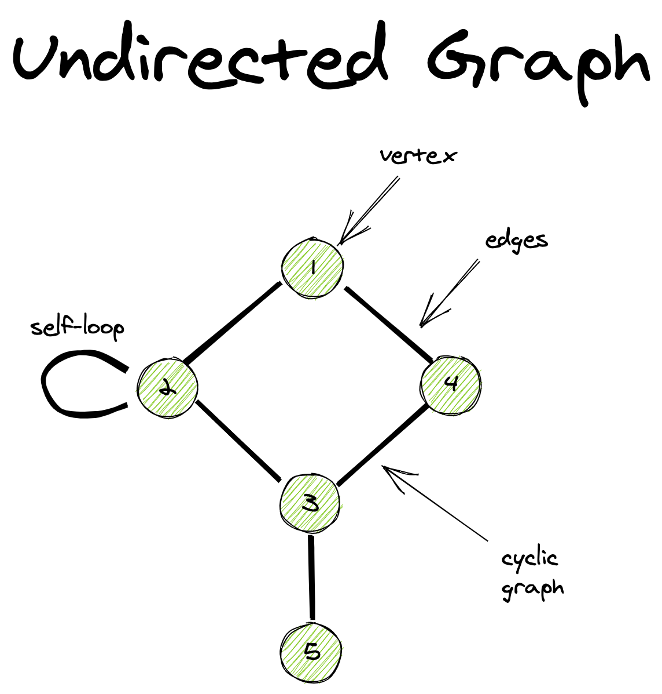

[](https://github.com/psf/black)
[](https://sonarcloud.io/dashboard?id=ipeternella_algorithms)
[](https://sonarcloud.io/dashboard?id=ipeternella_algorithms)
[](https://sonarcloud.io/dashboard?id=ipeternella_algorithms)
[](https://sonarcloud.io/dashboard?id=ipeternella_algorithms)
[](https://sonarcloud.io/dashboard?id=ipeternella_algorithms)
[](https://sonarcloud.io/dashboard?id=ipeternella_algorithms)

# Algorithms and Data Structures

🔬 A repo with Pythonic implementations of some algorithms and their underlying data structures. 🧪

## Table of Contents

The following classical algorithms are covered by this repo and written in modern Python, which includes the use of type hints and generic types support. Also, `pytest` is the main testing framework used to guarantee that the algorithms are operating as expected:

- [Fundamental Algorithms](#fundamental-algorithms)
  - [Singly Linked List](#singly-linked-List)
  - [Queues](#queues)
  - [Stacks](#stacks)
- [Searching Algorithms](#searching-algorithms)
  - [Binary Search For Lists](#binary-search-for-lists)
  - [Ordered Dictionary with two parallel lists](#ordered-dictionary-with-two-parallel-lists)
  - [Hash Maps](#hash-maps)
- [Graph Algorithms](#graph-algorithms)
  - [Undirected Graphs with Adjacent Sets](#undirected-graphs-with-adjacent-sets)
- [Running tests locally with Sonar](#running-tests-with-sonar)

## Fundamental Algorithms

The following fundamental algorithms are considered fundamental as they are the basis for many other more complex algorithms and data structures.

### Singly Linked List



Singly linked lists are covered and are built on top of a [single reference node](algorithms/data_containers/node_single_reference.py) which is used as a basic data container. By single reference node we mean a node that only holds one reference which is the to the next node in the list. Moreover, we consider linked lists that sustain a reference to the first and last nodes of the list which can be very useful to allow efficient operations on both edges of the list (this is the base for queues and stacks as well).

Algorithm implementation [here](algorithms/linked_lists/singly.py)

### Queues



Queues (FIFO -- First in, first Out -- data structures) are built here on top of the [singly linked list](#singly-linked-list) implementation because singly linked lists allows the following efficient operations:

- `O(1)` time complexity for insertions at the **end** of the list
- `O(1)` time complexity for removal (pop) of the first element of the list

Such efficient operations are required by FIFO data structures.

Algorithm implementation [here](algorithms/queues/fifo.py)

### Stacks



Stacks (LIFO -- Last in, first out -- data structures) are also built here on top of the [singly linked list](#singly-linked-list) data structures due to the efficient operations of the following operations:

- `O(1)` time complexity for insertions at the **beginning** of the list
- `O(1)` time complexity for removal (pop) of the first element of the list

Such efficient operations are requried by LIFO data structures.

Algorithm implementation [here](algorithms/stacks/lifo.py)

## Searching Algorithms

We begin the section of algorithms by considering the classic binary search and move on to more complex data structures that are required by efficient implementations of **symbol tables** or **dictionaries**.

### Binary Search For Lists

The efficient searching algorithm for sorted lists is covered here.

Algorithm implementation [here](algorithms/searching/binary_search.py)

### Ordered Dictionary with two parallel lists

Also known as `Symbol tables`, a simple dictionary implementation has been created using two parallel lists. The most important methods time complexity are as follows:

- `get(key, default)`: time complexity is `O(logN)` due to binary search
- `put(key, value)`: time complexity is `O(N)` for inserts (worst case due to whole array reallocation), and `O(1)` for updates. Hence, for M new key inserts we have: `O(M*N)` time complexity
- `pop(key)`: time complexity is `O(N)` (worst case due to whole array reallocation)

Algorithm implementation [here](algorithms/searching/symbol_tables/parallel_lists.py)

### Hash Maps

As hashes **cannot** be reversed, the hashed values (digests) cannot be used to reconstruct the original value (file, object, etc.). As such, it only allows one to determine whether two **objects are identical or not**.

## Graph Algorithms

A `graph` is a set of `vertices` and a collection of `edges` that each connect a pair of `vertices`. Hence, `trees` can be considered acyclic `graphs` but not the other way around (trees are a "subset" of graphs). For a `graph G` with `V` vertices and `E` edges to be considered a `tree`:

- `G` has `V - 1` edges;
- `G` is acyclic but adding an edge makes it cyclic;
- `G` is connected but removing a single edge disconnects it;
- One and **one only path** connects any pair of vertices in `G`

`Connected graph`: a graph in which there is a path **from every vertex** to **every other vertex**
`Parse graph`: a graph in which only a few of edge possibilities are present
`Dense graph`: a graph in which only a few of edge possibilities are missing (dense quantity of edges)

Some anomalies can exist in the edges:

- self-loop (edge that connects the same vertex);
- parallel edges (more than one edge connects the same pair of vertex)

Graph algorithms and implementations are covered in this repo. As of now, the following types of graphs have been implemented:

- [Undirected Graphs](#undirected-graphs-with-adjacent-sets)

### Undirected Graphs with Adjacent Sets



An undirect graph is is the simplest `graph` model in which edges are nothing more than mere connections between `vertices` and they hold no information such as a direction, weight, etc. One of the most common ways to represent a graph is to use the "adjacency lists" model (in contrast of "adjacency matrix" model).

Here, this graph has been represented with a symbol table to hold all `vertices` as keys and sets as values to hold all of the adjacent vertices of the given key vertex (adjacency sets).

Undirected graph implemented with adjacency sets [here](algorithms/graphs/undirected/adjacency_sets.py)

## Running Tests with Sonar

This project supports running `sonarqube` analysis by creating docker local containers via `docker-compose` commands which execute the instructions on the [docker-compose.yml](docker-compose.yml) file.

- `sonar`: brings up the `sonarqube` server which is used for the code and code coverage analysis
- `sonar scanner`: container which contains the `sonar-scanner` cli
- `tests`: container which runs the projec tests

The first step is to bring up the `sonar` server:

```bash
docker-compose up sonar  # authenticate on localhost:9000 and create an auth token there
```

If it's the first time running the `sonar`, go to `http://localhost:9000` and use the credentials `admin:admin (user:password)` to login. Also, a token will be generated for authenticating with this local sonar server on later steps such as: `c11361e5ce0719a8be5249dcc329f31` (example). Write this token down for later steps.

After that, we should run the project tests or the sonar analysis will be incomplete. For that, run:

```bash
docker-compose up tests  # will generate, via volume mounts, coverage.xml and test-results.xml files
```

This will generate `coverage.xml` and `test-results.xml` files required by sonar. One **very important** thing is that the `coverage.xml` will contain the test paths using absolute paths like `/app/algorithms`. As a consequence, we must put all of our source code in an `/app` folder inside the `sonar_scanner` container. This is crucial for the `sonar_scanner` to be able to understand the coverage paths on the analysis. The following `docker-compose.yml` snippet shows this mechanism:

```yml
sonar_scanner:
  container_name: algorithms_sonar_scanner
  image: sonarsource/sonar-scanner-cli:latest
  environment:
    - SONAR_HOST_URL=http://sonar:9000
  working_dir: /app # this is the same /app folder in which the tests are run!
  volumes:
    - .:/app # coverage.xml results filepath must begin with '/app'
```

`PS`: if `pytest` runs with `--cov=.` option, the absolute path consideration with `/app` is not really required as `sonar_scanner` will just raise a `WARN` but will understand the `coverage.xml` in anyway. However, if the project runs pytest with the option `--cov=algorithm` (coverage of the src code folder only), which changes the `coverage.xml` file's absolute path, then if the `/app` convention is not followed, `sonar_scanner` will raise `ERROR` instead of warnings and will NOT perform any coverage analysis. In order to avoid such problems, we run pytest with `--cov=.` so that no errors are observed even if we locally run `start-tests.sh` to run tests.

As a final step, we run the sonar analysis by running the `sonar_scanner` service which will capture our source code via volumes and send to the sonar server. Now, we execute a `docker-compose run` command by passing the auth token that we noted in the previous steps, and that's it:

```bash
docker-compose run -e SONAR_LOGIN=c11361e5ce0719a8be5249dcc329f31 sonar_scanner  # change with your local auth token
```

Now, just navigate to `http://localhost:9000` (sonar server page) and check out your code quality!
